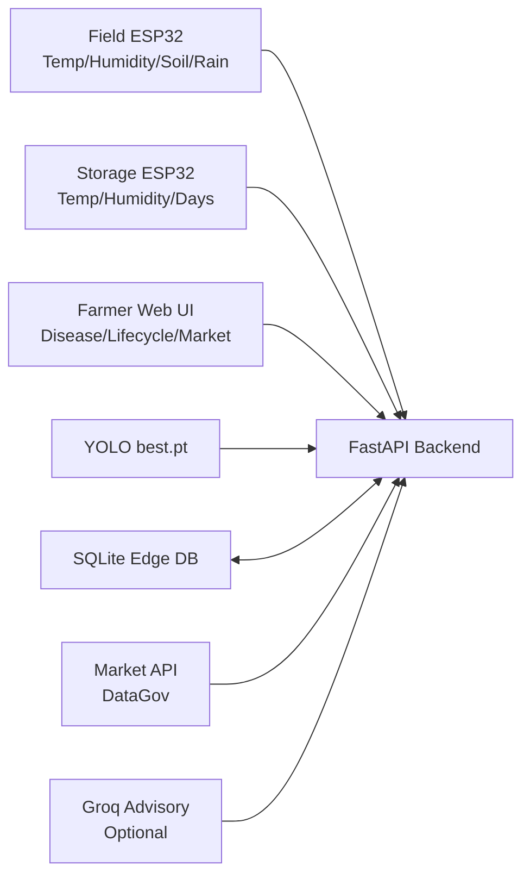

# Hackathon Presentation Pack

## Rubric Order to Follow
1. Business understanding and problem clarity (15)
2. Architecture & technical design (15)
3. Domain relevance (10)
4. Scalability (10)
5. Security / compliance awareness (10)
6. Innovation (20)
7. Implementation feasibility (10)
8. Presentation & documentation (10)

## Problem
Farmers lose yield and money due to delayed disease action, unclear harvest timing, and post-harvest spoilage/price uncertainty.

## Business Understanding and Problem Clarity (15)
- Real farmer workflow is continuous: crop health -> storage quality -> sell timing.
- Existing fragmented tools do not provide one decision chain.
- Our platform reduces response delay and improves decision confidence.

## Solution
A unified, AI-driven platform that combines:
- Leaf disease detection with visual evidence (bounding boxes)
- Sensor-driven crop lifecycle intelligence
- Post-harvest sell timing and storage suitability

## Architecture (Demo)

## Domain Relevance (10)
- Rice and common cold-storage commodities are directly supported.
- Local-language advisories improve practical adoption.
- Uses data signals that farmers can realistically collect.
- UI includes category-wise commodity selection and commodity-aware decision outputs.

## Scalability (10)
- Modular API architecture supports additional crops, sensors, and regions.
- Database and ingestion can be upgraded to cloud + MQTT without changing UX.
- Device count can scale by extending submit endpoints and queueing layer.

## Security and Compliance Awareness (10)
- Environment-based keys and local-first deployment reduce exposure in MVP.
- Clear boundary between device ingest, inference, and UI routes.
- Future plan: auth, role control, audit logs, encrypted transport.

## Innovation Highlights
- End-to-end pipeline from field sensing to market decision
- Offline-capable local fallback for advisory and market demo mode
- Multilingual farmer recommendations (`English`, `Hindi`, `Telugu`)
- Explainable decision outputs (risk scores + reasons)

## Implementation Feasibility (10)
- Built and runnable on local machine with Python 3.10.
- Includes working ESP32 field and storage firmware.
- Demo scripts validate readiness and handle fallback data flow.

## Presentation and Documentation (10)
- Full docs available in docs/PROJECT_DOCUMENTATION.md.
- Rubric-aligned deck flow in docs/PRESENTATION_GUIDE.md.
- Name strategy in docs/PROJECT_NAMING.md.

## Demo Script (4 Minutes)
1. Open disease page and run image prediction with bounding boxes.
2. Open lifecycle dashboard and show field/storage connection badges.
3. Change language and show recommendation localization.
4. Open market page, explain trend and sell/hold decision logic.
5. Run `scripts/demo_check.ps1` as live system proof.

## Judge-Facing KPIs
- Disease detection confidence and response speed
- Environmental risk score and harvest readiness estimates
- Spoilage risk reduction through storage guidance
- Profit delta from sell timing recommendations

## Backup Plan (If Sensors/API Fail)
- Run `scripts/send_demo_data.ps1` to inject live-looking field/storage signals
- Market module auto-falls back to demo data with source transparency
- Advisory remains functional in local mode (`ENABLE_ONLINE_ADVISORY=false`)

## Final Checklist
- Backend running on port 5000
- `scripts/demo_check.ps1` shows backend OK
- At least field node connected for `ready_for_demo=true`
- Storage node connected OR demo data seeded
- Market source live if API key is authorized; otherwise explain fallback
